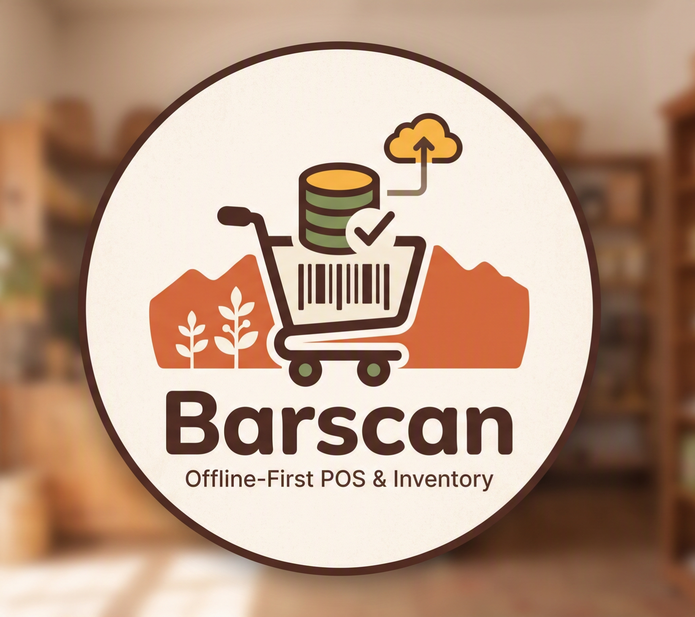
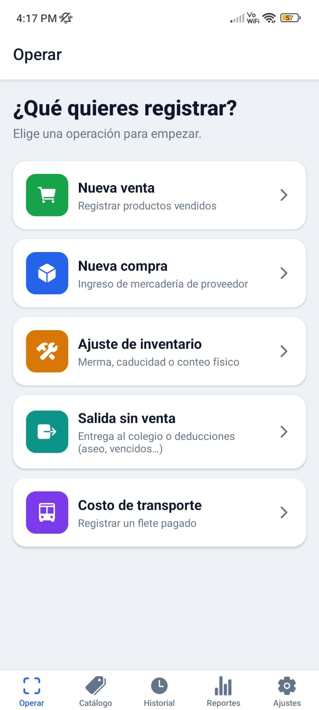
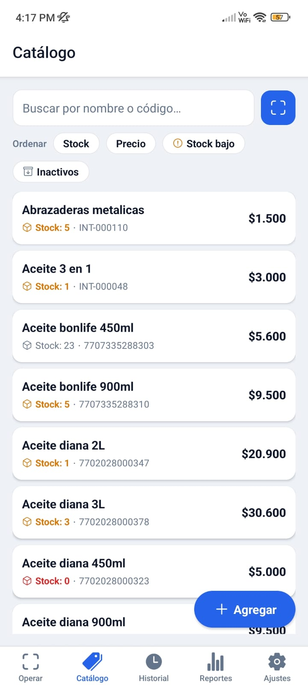
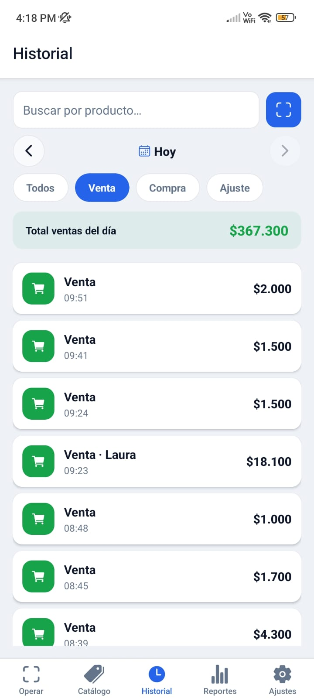
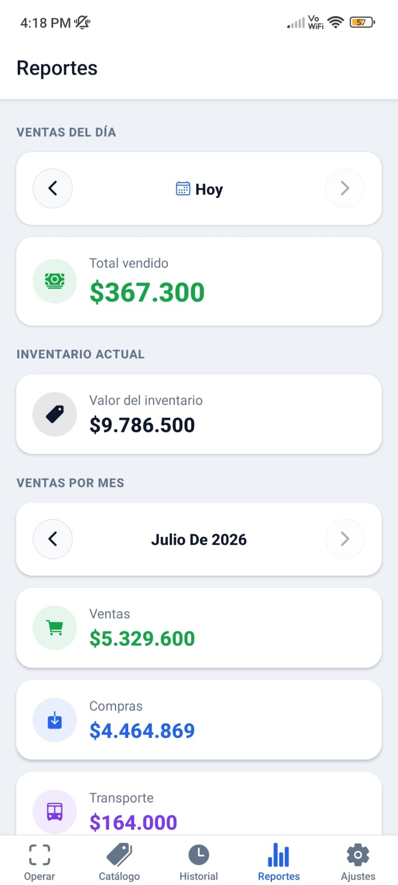
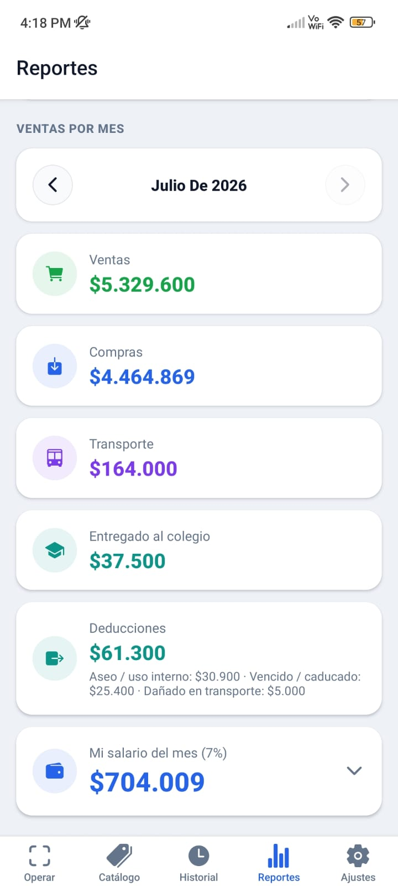
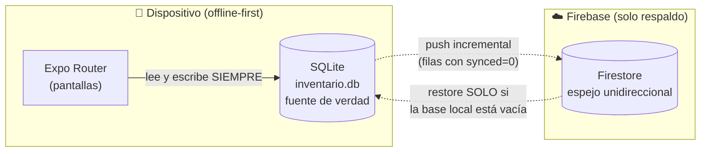

<p align="center">
  
</p>

<h1 align="center">BarScan</h1>

> **Inventario y punto de venta offline-first para tiendas de barrio** — construido con Expo + React Native, probado en producción en una tienda comunal rural de Colombia.


Una tienda tradicional de abarrotes que manejaba **todo en papel**: cientos de productos, sin forma práctica de hacer balance, con conectividad inestable como norma. BarScan digitaliza su operación completa — catálogo, ventas, compras, ajustes de stock y reportes — funcionando **100% sin internet**, con la cámara del teléfono como lector de código de barras.

Esto no es un proyecto de tutorial: es software que **se usa a diario en un negocio real**, con decisiones de arquitectura derivadas de restricciones reales y **11 iteraciones de mejora surgidas de la prueba en campo**.

---

## 📸 Capturas

*Datos reales de operación diaria en la tienda.*

| Operar | Catálogo | Historial |
|:---:|:---:|:---:|
|  |  |  |

| Reportes del día | Reportes del mes |
|:---:|:---:|
|  |  |

---

## ✨ Funcionalidades

### Operación diaria
- **Escáner de códigos de barras** (EAN-13/EAN-8/UPC-A/UPC-E) con la cámara, con debounce anti-doble-lectura y pausa controlada entre escaneos.
- **Sesiones de venta, compra y ajuste**: se escanean productos y cada lectura repetida incrementa la cantidad — imita el gesto natural de pasar cada unidad por un lector. Total en tiempo real.
- **Productos a granel / sin código**: reciben un código interno autogenerado (`INT-000123`) que ocupa el mismo campo `barcode`, así el resto del modelo (líneas, reportes) no necesita casos especiales. Búsqueda por nombre integrada al mismo flujo.
- **Tope de stock en ventas**: no se puede vender más de lo que hay; el escáner avisa si te pasás.
- **Recálculo de precio en vivo en compras**: al tipear el nuevo costo, la app sugiere el precio de venta según el margen del producto (o el general), editable para redondear.
- **Salidas sin venta**: entregas (ej. al colegio de la vereda) y deducciones con motivo — aseo/uso interno, vencido/caducado, dañado en transporte. Descuentan stock valorizado sin contaminar las ventas.
- **Costo de transporte**: registro de fletes pagados, como categoría propia del flujo de caja (no se mezcla con compras).

### Inventario y catálogo
- **Carga inicial por sesión de escaneo**: se recorre la tienda escaneando producto por producto; el conteo inicial queda registrado como movimiento trazable.
- **Precio por margen o precio fijo** por producto, con margen general configurable y override individual.
- **Ajustes de inventario con motivo** (merma, caducidad, conteo físico): afectan stock pero **no contaminan** los reportes de dinero.
- Catálogo con **orden por stock/precio, filtro de stock bajo, indicador de agotado** y borrado lógico (desactivar/reactivar sin perder historial).
- Búsqueda **insensible a acentos** y tolerante al orden de las palabras.

### Reportes y trazabilidad
- **Ventas del día** con selector de fecha y **valor del inventario actual**.
- **Resumen mensual completo**: ventas, compras, transporte, entregas y deducciones desglosadas por motivo — el flujo de caja real del negocio, no solo ventas.
- **Salario del encargado** calculado como porcentaje configurable sobre el movimiento del mes.
- **Utilidad honesta**: solo se calcula sobre ventas con costo conocido — nada de números inventados.
- **Reportes imprimibles en PDF** (inventario inicial, ventas por día/mes) generados con HTML/CSS y compartidos por el diálogo nativo.
- **Historial filtrable** por fecha, tipo de operación y producto (por texto o escaneando el código).

### Respaldo y seguridad
- **Respaldo automático a Firestore** (espejo unidireccional): cada fila modificada se marca `synced=0` y un proceso ligero la empuja cuando hay red, en lotes.
- **Recuperación ante pérdida del teléfono**: en un equipo nuevo con base vacía, la app restaura todo desde el respaldo.
- **Login con email/clave + ingreso con huella** (credenciales cifradas en SecureStore). La huella es un atajo local, no un método de recuperación.

---

## 🧭 Enfoque práctico: del papel a producción

Lo que diferencia a este proyecto es el ciclo completo: **problema real → diseño → APK → uso en campo → iteración**.

1. **Demo técnica primero**: antes de escribir el sistema, se validó lo crítico — que la cámara de un teléfono de gama media leyera códigos de barras con latencia aceptable. Sin eso, no había proyecto.
2. **Diseño con restricciones reales**: un solo usuario, Android, conectividad inestable, cero listado digital previo. Cada decisión de arquitectura sale de ahí.
3. **Build de campo con EAS**: APK instalado en el teléfono real de la tienda (perfil `preview`), variables de entorno gestionadas en EAS.
4. **Prueba en campo → 11 iteraciones**: el uso real produjo mejoras que ningún tutorial te enseña — `selectTextOnFocus` para no tener que borrar el "0", el último producto escaneado arriba de la lista con resaltado temporal, vista previa del stock resultante en ajustes, búsqueda insensible a acentos porque así se escribe en el mundo real. Detalle completo en [docs/ajustes-prueba-campo.md](docs/ajustes-prueba-campo.md).

**Hallazgos de campo** documentados en [PLAN.md](PLAN.md):
- La base local de Expo Go es **distinta** a la del APK instalado — probar módulos nuevos exige restaurar desde el respaldo.
- Los códigos de peso variable y simbologías fuera de EAN/UPC no leen de forma fiable → se tratan como productos "sin código".

---

## 🏗 Arquitectura

### Principio rector: SQLite es la única fuente de verdad



La app **nunca lee de Firestore en operación normal**. Se descartó el modo offline de Firestore como base local para no mantener dos bases con lógica de reconciliación — con un solo usuario y un solo dispositivo, un espejo unidireccional es más simple, más barato y más robusto.

### Decisiones técnicas clave

| Decisión | Por qué |
|---|---|
| **Snapshots de precio/costo por línea** | Cada ítem de transacción guarda el precio *al momento de la operación*, no una referencia al catálogo. Sin esto, los reportes históricos se distorsionan cuando los precios cambian. |
| **Dinero como enteros (COP)** | Cero errores de punto flotante. El peso colombiano no usa decimales en la práctica. |
| **`synced` + índices parciales** | Índices `WHERE synced = 0` hacen que encontrar filas pendientes de respaldo sea O(pendientes), no O(tabla). |
| **Migraciones con `PRAGMA user_version`** | Versionado de esquema simple y aditivo (nunca renombrar/borrar columnas) para no romper el espejo de respaldo. |
| **Código interno `INT-` para granel** | Los productos sin código de barras usan el mismo campo `barcode` — el modelo de datos no tiene casos especiales. |
| **Ajustes fuera de los reportes de dinero** | Merma y conteos afectan stock, pero jamás se cuentan como ingreso/egreso. |
| **Cola serializada de respaldo** | `expo-sqlite` no admite transacciones concurrentes en una conexión; respaldo y restauración se serializan en una sola cola de promesas. |
| **WAL + foreign keys ON** | Escrituras no bloquean lecturas; integridad referencial real. |

### Modelo de datos

Cuatro tablas, sin ORM — SQL directo y tipado con TypeScript estricto:

```
productos          (barcode PK, precio, costo, margen, stock_actual, activo, synced…)
transacciones      (id, tipo: compra|venta|ajuste, fecha, total, synced…)
transaccion_items  (snapshots de nombre, costo y precio unitario, synced…)
configuracion      (clave/valor: margen general, moneda, correlativo interno)
```

---

## 🛠 Stack

| Capa | Tecnología |
|---|---|
| Framework | [Expo SDK 54](https://docs.expo.dev/versions/v54.0.0/) + React Native 0.81 + React 19 |
| Navegación | Expo Router 6 (file-based routing, tabs + rutas dinámicas) |
| Lenguaje | TypeScript estricto |
| Base de datos | expo-sqlite (WAL, migraciones versionadas) |
| Escáner | expo-camera (EAN/UPC) |
| Respaldo | Firebase JS SDK → Firestore |
| Autenticación | Firebase Auth + expo-local-authentication (huella) + expo-secure-store |
| PDF | expo-print + expo-sharing |
| Distribución | EAS Build (APK preview / AAB production) |

Sin librerías de estado global, sin ORM, sin UI kit: **la complejidad está donde aporta valor** (modelo de datos, sincronización), no en dependencias.

## 📁 Estructura

```
app/                    # Expo Router (file-based)
├── (tabs)/             # Operar, Catálogo, Historial, Reportes, Ajustes
├── transaccion/[tipo]  # Sesión de venta / compra / ajuste
├── producto/           # Ficha y alta de producto
└── carga-inicial       # Sesión de escaneo para inventario inicial
components/             # ScannerView, BuscadorProducto, SyncManager, ui/
db/                     # Esquema, migraciones, queries tipadas por dominio
lib/                    # auth, backup (espejo Firestore), PDF, fechas, red
theme/                  # Design tokens
docs/                   # Bitácora de prueba en campo y pendientes
```

## 🚀 Cómo correrlo

```bash
# 1. Instalar dependencias
npm install

# 2. Configurar Firebase (respaldo) — opcional para probar la operación local
cp .env.example .env    # completar EXPO_PUBLIC_FIREBASE_*

# 3. Levantar en desarrollo
npm start               # Expo Go en el teléfono (Android recomendado)
```

**Builds de distribución** (requiere cuenta EAS y variables cargadas en EAS):

```bash
npm run build:android:apk   # APK instalable (perfil preview)
npm run build:android:aab   # App Bundle para Play Store
```

> **Nota:** la base local de Expo Go y la del APK instalado son independientes. El escáner requiere dispositivo físico (la cámara no funciona en emulador para códigos de barras reales).

## 🗺 Roadmap

- [ ] Ampliar simbologías del escáner (Code-128, ITF)
- [ ] Respaldo en background (requiere development build)
- [ ] Respaldar cambios de solo configuración

## 📄 Licencia

MIT — ver [LICENSE](LICENSE).

---

*Construido con enfoque de producto: primero validar lo riesgoso, después construir lo necesario, y dejar que el uso real dicte las iteraciones.*
